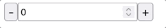

# preact-nominal-allocator



## Installation

```bash
npm i preact-nominal-allocator
```

## Usage

```html
<!DOCTYPE html>
<html>
  <head>
    <meta charset="utf-8" />
    <title>Preact Nominal Allocator Demo</title>
    <script type="module" defer>
      import { Component, render, h } from "https://unpkg.com/preact@10.6.4?module";
      import htm from "https://unpkg.com/htm?module";
      import preset from "https://unpkg.com/jss-preset-default@10.9.0";
      import { create } from "https://unpkg.com/jss@10.9.0";
      import NominalAllocator from "./js/out.js";

      const html = htm.bind(h);
      const jss = create(preset());

      const style = {
        allocatorContainer: {
          display: "flex"
        },
        allocatorButtonPlus: {
          fontSize: 18
        },
        allocatorButtonMinus: {
          fontSize: 18
        },
        allocatorNumberInput: {}
      };

      const { classes } = jss.createStyleSheet(style).attach();

      render(
        html`
            <${NominalAllocator}
              min="${0}"
              max="${12}"
              onUpdate="${console.log}"
              styles="${classes}"
            />
        `,
        document.body
      );
    </script>
  </head>
  <body></body>
</html>
```

### Notes

- Attributes:
  - `min` lowest input value
  -  `max` highest input value
  -  `value` current value
  -  `onUpdate` used to update the current value
    
`NominalAllocator` inserts inline classes via [JSS](https://cssinjs.org).  It
  allows users to customize its style (via `styles` attribute) by adjusting
  classes like  `.allocatorContainer`,`.allocatorButtonPlus`,
  `.allocatorButtonMinus`, and `.allocatorNumberInput`.

## Contributing

```bash
$ git clone git@github.com:TimDaub/preact-nominal-allocator.git
$ cd preact-nominal-allocator
$ npm i
$ npm run dev
```

## License

See LICENSE file or package.json.
